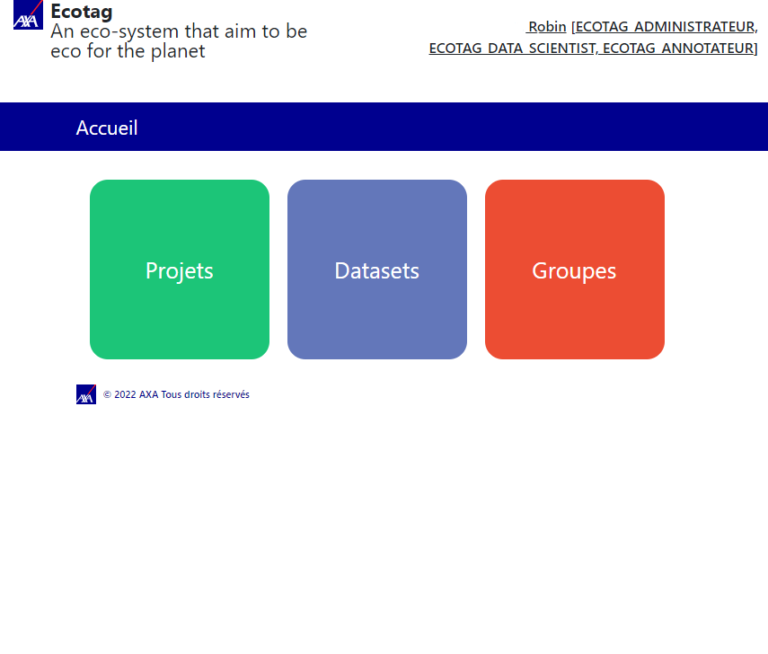
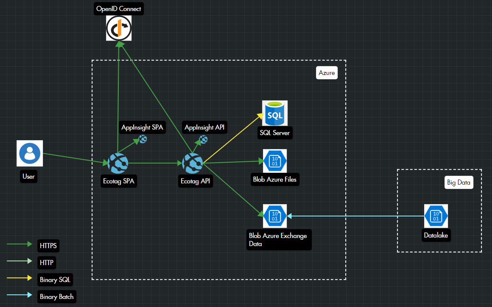

# Ecotag

[](https://github.com/AxaGuilDEv/ml-cli/actions/workflows/ml-cli-ci.yml)
[](https://sonarcloud.io/dashboard?id=AxaGuilDEv_ml-cli) [](https://sonarcloud.io/component_measures?id=AxaGuilDEv_ml-cli&metric=reliability_rating) [](https://sonarcloud.io/component_measures?id=AxaGuilDEv_ml-cli&metric=security_rating) [](https://sonarcloud.io/component_measures?id=AxaGuilDEv_ml-cli&metric=Coverage) [](https://twitter.com/intent/follow?screen_name=GuildDEvOpen)

- [About](#about)
- [Getting Started](#getting-started)
- [How It Works](#how-it-works)
- [Contribute](#contribute)




# About

Ecotag an is an awesome annotation tools.
- Manage OIDC authentication
- Manage teams 
- Manage roles (ECOTAG_ADMINISTRATEUR, ECOTAG_DATA_SCIENTIST, ECOTAG_ANNOTATEUR)
- Manage datasets
- Create labelling project
  - Image Zoning
  - Image Classification
  - Image Rotation
  - Image Transcription
  - Text NER Zoning
  - Eml classification
- Labelling Export 


# Getting started

To run the demo with .NET 6 on your machine :

```sh

# Run blob storage and SQL Server
cd ./ml-cli
docker-compose up -d

cd ./ml-cli/src/Ml.Cli.WebApp
dotnet run 
# run Ecotag
# you can navigate at https://localhost:5001

```

# How it works

Technologies:
- react
- .NET 6
- OpenID Connect 



# Contribute

- [How to run the solution and to contribute](./CONTRIBUTING.md)
- [Please respect our code of conduct](./CODE_OF_CONDUCT.md)