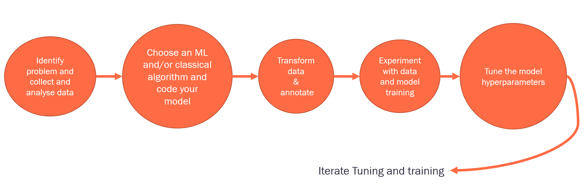
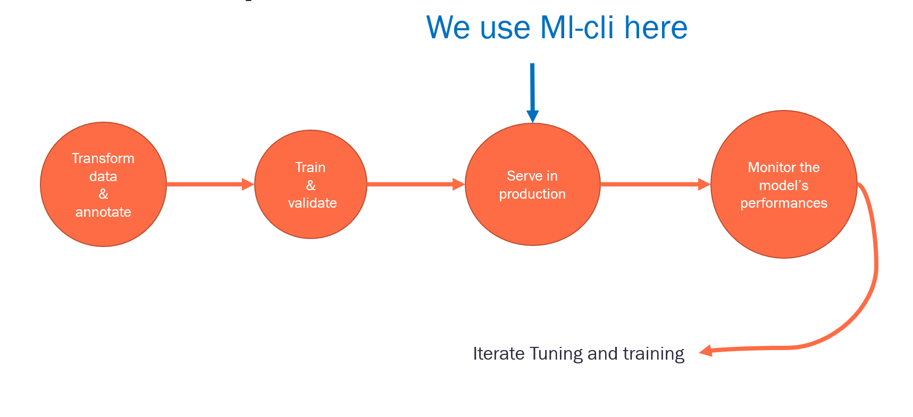
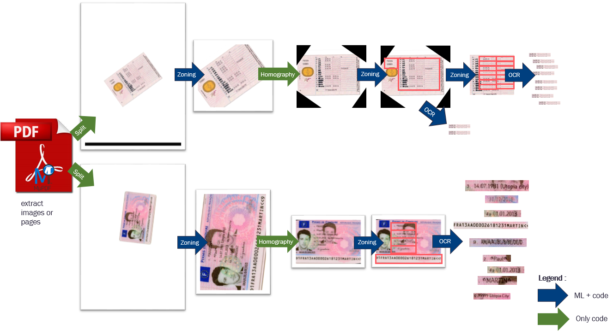
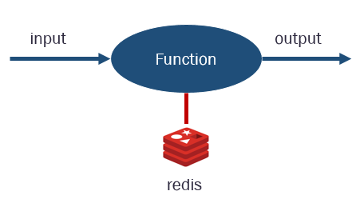
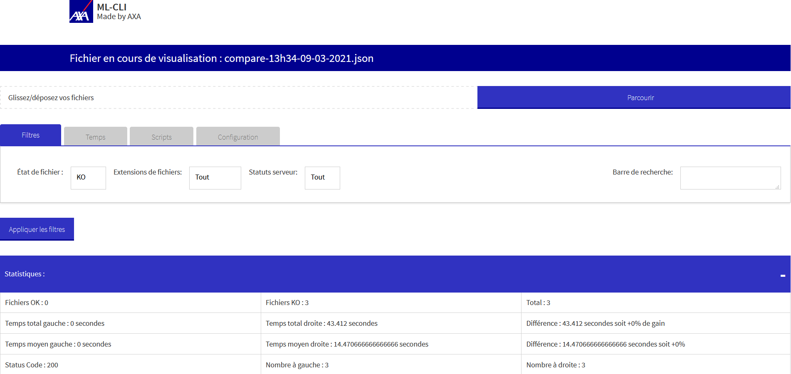
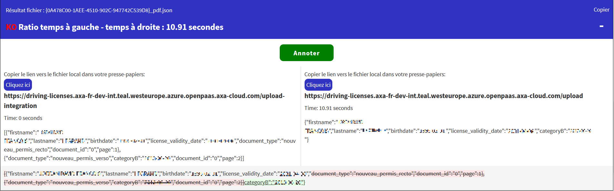
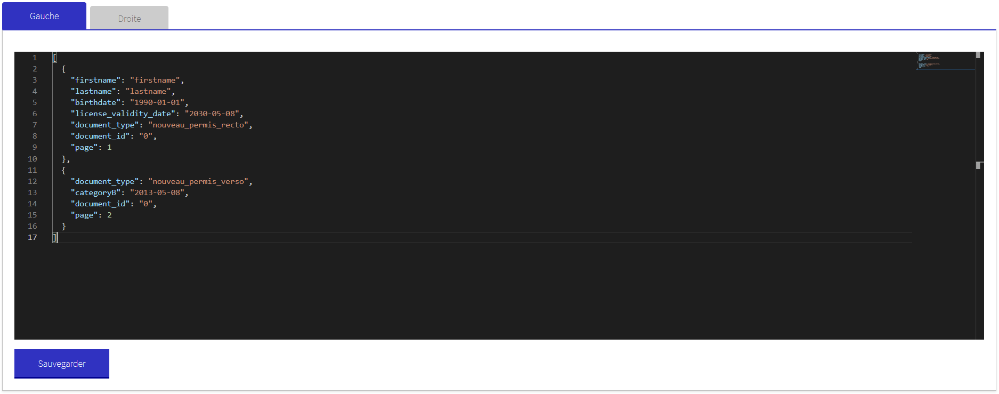
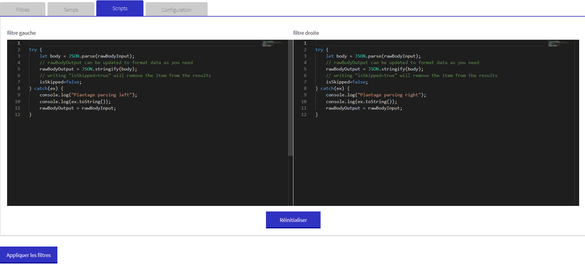

# ML-CLI

[](https://dev.azure.com/axaguildev/ml-cli/_build/latest?definitionId=6&branchName=master)
[](https://sonarcloud.io/dashboard?id=AxaGuilDEv_ml-cli) [](https://sonarcloud.io/component_measures?id=AxaGuilDEv_ml-cli&metric=reliability_rating) [](https://sonarcloud.io/component_measures?id=AxaGuilDEv_ml-cli&metric=security_rating) [](https://sonarcloud.io/component_measures?id=AxaGuilDEv_ml-cli&metric=Coverage) [](https://twitter.com/intent/follow?screen_name=GuildDEvOpen)

- [About](#about)
- [Getting Started](#getting-started)
- [How It Works](#how-it-works)
- [Warning](#warning)
- [Contribute](#contribute)

# About

Ml-Cli is a command line batch and a local web interface&api that automates :
- API integration tests (with server-server OIDC Authentication)
- Compare datasets (images, json), for:
    - Debugging
    - Annotations corrections
- Aspirate datasets (images, json), for:
    - Pre-annotation
    - Comparison
- Reformat datasets 
- Calculations
    - Error rate character
    - Zoning error rate
    - Completeness rate
- Document annotations
    - NER
    - Cropping/Zoning/BoundingBox
    - Rotation
    - TagOverText
    - TagOverTextLabel
    - Json

We use ml-cli mainly in the ML Flow production phase. We use it to test and **visually** debug  complexe pipeline.

## ML workflow: Experimentation phase 



## ML workflow: Production phase
 


## Production workflow (sample)

In production we use complexe sequence of algorithm ML in a micro-service architecture. 



# Getting started

To run the demo with .net core 3.1 on your machine :

```sh
git clone https://github.com/AxaGuilDEv/ml-cli
cd ./ml-cli/src/Ml.Cli.DemoApi
dotnet run
# run demo API, you can navigate at https://localhost:6001/licenses/version

cd ./ml-cli/src/Ml.Cli.WebApp
dotnet run -- C:\github\ml-cli\demo\ ..\..\demo\tasks-licenses.json  ..\..\demo
# run ml-cli batch + web application
# you can navigate at https://localhost:5001

```

 - **First parameter** : Security path. The base path where ml-cli "only" can access to your file. Should be a full path.
 - **Second parameter** : The path of the tasks.json, that file that describe tasks to execute.
 - **Third parameter** : Default base directory used by the path inside your task.json.

```sh
# you can also run ml-cli batch only
 cd ./ml-cli/src/Ml.Cli
dotnet run -- ..\..\demo\tasks-licenses.json  ..\..\demo
```

ML-Cli autonomous x64 distribution is available on :

- Linux (Ubuntu)
- Red Hat Enterprise 6+
- MacOS
- Windows 10

 [Check out the artifact on the latest build on master](https://dev.azure.com/axaguildev/ml-cli/_build?definitionId=11)

```sh
# Run on Windows
Ml.Cli.WebApp.exe C:\github\ml-cli\demo\ ..\..\demo\tasks-licenses.json  ..\..\demo

# Run on Mac 
Ml.Cli.WebApp /github/ml-cli/demo/ ../../demo/tasks-licenses.json  ../../demo
```

# How it works

## Production architecture

We use microservice architecture when needed and mainly use "functions". Each algorithm can be hosted by a function. We mainly use redis to share data bewteen functions.



We have normalized mandatory HTTP functions routes:
- **/**
- **/upload** : build for debugging and ml-cli
- **/upload-integration** : build for debugging and ml-cli
- **/version** : used by ml-cli
- **/health**
- **/metrics**

```sh
# the default route used internally by all services
/ 

input :
{
    "id": "file_id"
    "settings": {...}
}

# the route bellow add files url in the output data
/upload

input :
curl --request POST \
  --url https://localhost:6001/licenses/upload-integration \
  --header 'Content-Type: multipart/form-data' \
  --form file= 'binary data'\
  --form settings= 'binary data'

output :
{
  "analysis": [
    {
      "elements": [
        {
          "document_type": "nouveau_permis_recto",
          "confidence_rate": 99.69,
          "license_delivery_country": "France"
          "url_file_new_recto_zone": "http://localhost:6001/files/5e0d28d8-17ea-42b7-ac24-f4192e8e103c",
          "input_new_recto_zone" : {"id":"5e0d28d8-17ea-42b7-ac24-f4192e8e103c"}
          "output_new_recto_zone" : {"zones":[{"confidence": 0.95,"coordinates": {"xmax": 3749,"xmin": 289,"ymax": 2620,"ymin": 917},"label": "nouveau_permis_recto"}]}
        }]
    }]
 "version": "1.0.0"
}

# this route alway return the same output (remove version number etc.)
/upload-integration 

curl --request POST \
  --url http://localhost:6001/upload-integration \
  --header 'Content-Type: multipart/form-data' \
  --form file= 'binary data'\
  --form settings= 'binary data'

output :
{
  "analysis": [
    {
      "elements": [
        {
          "document_type": "nouveau_permis_recto",
          "confidence_rate": 99.69,
          "license_delivery_country": "France"
        }]
    }]
}

# the route version bellow add files url ine the output data
/version

output : 
{"version":"1.0.3"}

# the route health bellow is used by kubernetes to know the pod health
/health

output : 
{"status":"OK"}

# the route metrics bellow give internal pod data to prometheus
/metrics

output: 
# HELP python_gc_objects_collected_total Objects collected during gc
# TYPE python_gc_objects_collected_total counter
python_gc_objects_collected_total{generation="0"} 7585.0
python_gc_objects_collected_total{generation="1"} 806.0
python_gc_objects_collected_total{generation="2"} 0.0
etc.

```

## Ml-Cli batch

You can execute several tasks in command line interface (CLI):
- [`wait_version_change`](./src/Ml.Cli/JobVersion#readme) is a task that will wait for the version obtained via the url to change for a user-defined amount of time.
- [`callapi`](./src/Ml.Cli/JobApiCall#readme) is a task which will call an online service to get jsons files describing files containing images. These json files contain a list of URLs leading to extracted images of the files containing images. The task can also download these images after generating the related json file.
- [`parallel`](./src/Ml.Cli/JobParallel#readme) and serial are used to describe the way of handling your tasks.
- [`serial`](./src/Ml.Cli/JobSerial#readme) are used to describe the way of handling your tasks.
- [`loop`](./src/Ml.Cli/JobLoop#readme) is used to execute the task indefinitely.
- [`script`](./src/Ml.Cli/JobScript#readme) will execute a user-defined script on files stored in a repository.
- [`compare`](./src/Ml.Cli/JobCompare#readme) is used to compare two sets of json files; the resulting json file can be used to see the results with the help of the server.
- [`dataset`](./src/Ml.Cli/JobDataset#readme) is used to generate a dataset file which will contain all annotations (of a same, user-specified type and configuration) made on json files with the help of Ml-Cli front.


### tasks-sample.json

``` 
[
	{
		"type": "wait_version_change",
		"id": "version_task",
		"enabled": true,
		"url": "https://localhost:6001/licenses/version",
		"timeout": 5000,
		"urlLogDirectory": "licenses\\output\\logs",
		"logFileName": "license.json"
	},
	{
		"type": "callapi",
		"enabled": true,
		"enabledSaveImages":true,
		"outputDirectoryImages": "licenses\\groundtruth\\images",
		"fileDirectory": "licenses\\documents",
		"outputDirectoryJsons": "licenses\\groundtruth\\jsons",
		"numberParallel": 1,
		"url" :"https://localhost:6001/licenses/upload"
	},
	{
		"type": "callapi",
		"enabled": true,
		"enabledSaveImages":true,
		"outputDirectoryImages": "licenses\\output\\{start-date}\\images",
		"fileDirectory": "licenses\\documents",
		"outputDirectoryJsons": "licenses\\output\\{start-date}\\jsons",
		"numberParallel": 1,
		"url" :"https://localhost:6001/licenses/upload"
	},
	{
		"type": "compare",
		"enabled": true,
		"onFileNotFound": "warning",
		"leftDirectory": "licenses\\groundtruth\\jsons",
		"rightDirectory": "licenses\\output\\{start-date}\\jsons",
		"outputDirectory": "licenses\\output",
		"fileName": "compare-licenses-{start-date}.json"
	  }
]
```

## ML-Cli local web interface and local API

Ml-cli web interface internally run the Ml-cli batch. 
It display a user interface and allow the user to annotate data via a Web API.

### Compare statistiques


### Compare diff



### Compare annotation

You can annotate the downloaded images (obtained with the task callapi described below) via an editor by clicking on the annotation button.



### Example of script



You can provide scripts to apply to the recovered data that is displayed in the file comparison part of the interface. Applying these scripts will format the data and update the statistics table accordingly.
That script can also be applied with the script task described below.
Please note that 3 parameters are given to your script:
- **isSkipped** is an attribute that, if set to true, will remove the item from the file comparison table. It will also not be taken into account to generate the statistics table.
- **rawBodyInput** is the input of the script. That input is the data you can see in the file comparison table, which is also the content of the "Body" parameter of a callapi json.
- **rawBodyOutput** is the output of the script. The script defined by the user has to provide a value for this parameter, as it is the one that will appear in the file comparison table after script application. Please note that a "return" keyword is not required, as the API will collect rawBodyOutput after script application.


# Warning

The current web API is available for local usage only. Security is not guaranteed otherwise.

# Contribute

- [How to run the solution and to contribute](./CONTRIBUTING.md)
- [Please respect our code of conduct](./CODE_OF_CONDUCT.md)